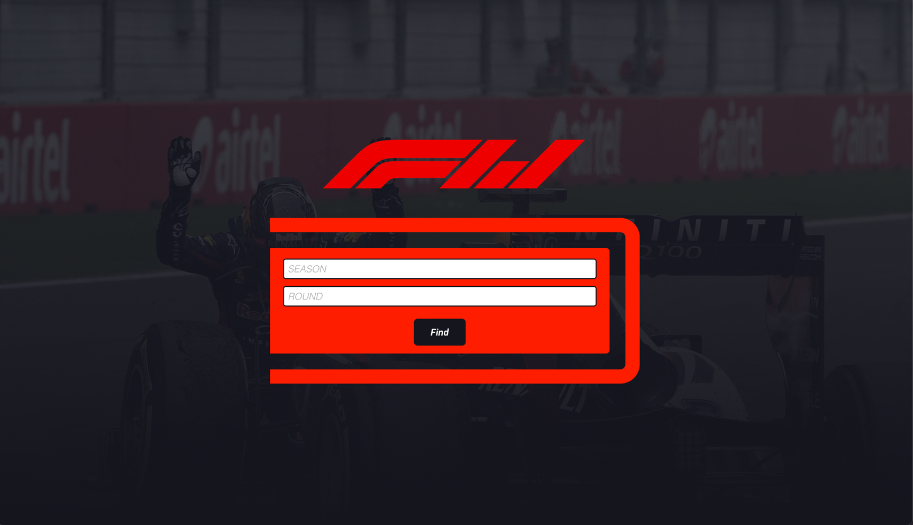
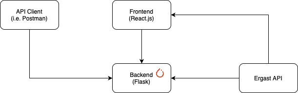
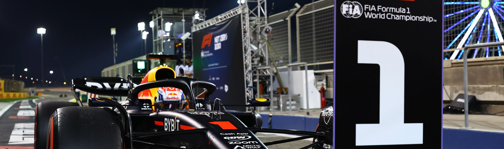
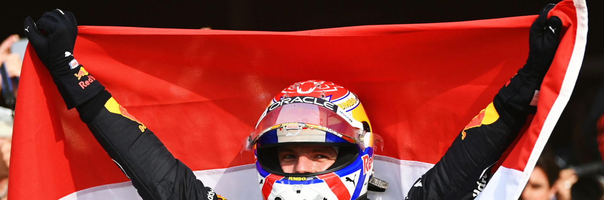

# Formula Won
## Formula 1 Race Predicting with Machine Learning
___


Formula Won is an API to help enthusiests predict the winner of any F1 race, current or future. The API features three endpoints that can predict either the winner, the most likely winners, or if the polesitter can convert their position to a victory with data from the Ergast API.

## Links
___
API: https://formulawon-v3-495986580044.us-central1.run.app 

Website: https://formulawonfe.web.app

## Endpoints
___
Click each endpoint to reveal more.
<details>
 <summary><code>GET</code> <code><b>/predictpole/{season}/{round}</b></code> <code>(Predicts if the polesitter of a race will go on to win.)</code></summary>

##### Parameters

> | name   | type     | data type | description                        |
> |--------|----------|-----------|------------------------------------|
> | season | required | number    | The year of the season (e.g. 2024) |
> | round  | required | number    | The round of the race (e.g. 11)    |

##### Headers

> | name  | type     | data type     | description                    |
> |-------|----------|---------------|--------------------------------|
> | order | optional | object (dict) | overrides the qualifying order |

##### Responses

> | http code | content-type                      | response                                                                                            |
> |-----------|-----------------------------------|-----------------------------------------------------------------------------------------------------|
> | `200`     | `application/json`        | `{'winner': bool}`                                                                                  |
> | `404`     | `application/json`                | `{'apiVersion': 2.0, 'error': {'code': 404, 'message': 'ERROR: The race was not found.'}}`          |
> | `500`     | `application/json`                | `{'apiVersion': 2.0, 'error': {'code': 500, 'message': 'ERROR: Something went wrong.'}}`            |
> | `503`     | `application/json`         | `{'apiVersion': 2.0, 'error': {'code': 503, 'message': 'ERROR: The Ergast API was unresponsive.'}}` |

##### Example cURL

> ```javascript
>  curl -X GET https://formulachaeone-495986580044.us-central1.run.app/predictpole/2024/11
> ```

</details>

<details>
 <summary><code>GET</code> <code><b>/predictquali/{season}/{round}</b></code> <code>(Predicts the driver most likely to win.)</code></summary>

##### Parameters

> | name   | type     | data type | description                        |
> |--------|----------|-----------|------------------------------------|
> | season | required | number    | The year of the season (e.g. 2024) |
> | round  | required | number    | The round of the race (e.g. 11)    |

##### Headers

> | name  | type     | data type     | description                    |
> |-------|----------|---------------|--------------------------------|
> | order | optional | object (dict) | overrides the qualifying order |

##### Responses

> | http code | content-type                      | response                                                                                            |
> |-----------|-----------------------------------|-----------------------------------------------------------------------------------------------------|
> | `200`     | `application/json`        | `{'winner': int}`                                                                                   |
> | `404`     | `application/json`                | `{'apiVersion': 2.0, 'error': {'code': 404, 'message': 'ERROR: The race was not found.'}}`          |
> | `500`     | `application/json`                | `{'apiVersion': 2.0, 'error': {'code': 500, 'message': 'ERROR: Something went wrong.'}}`            |
> | `503`     | `application/json`         | `{'apiVersion': 2.0, 'error': {'code': 503, 'message': 'ERROR: The Ergast API was unresponsive.'}}` |

##### Example cURL

> ```javascript
>  curl -X GET https://formulachaeone-495986580044.us-central1.run.app/predictquali/2024/11
> ```

</details>

<details>
 <summary><code>GET</code> <code><b>/predictqualilist/{season}/{round}</b></code> <code>(Predicts a shortlist of the drivers most likely to win.)</code></summary>

##### Parameters

> | name   | type     | data type | description                        |
> |--------|----------|-----------|------------------------------------|
> | season | required | number    | The year of the season (e.g. 2024) |
> | round  | required | number    | The round of the race (e.g. 11)    |

##### Headers

> | name  | type     | data type     | description                    |
> |-------|----------|---------------|--------------------------------|
> | order | optional | object (dict) | overrides the qualifying order |

##### Responses

> | http code | content-type                      | response                                                                                            |
> |-----------|-----------------------------------|-----------------------------------------------------------------------------------------------------|
> | `200`     | `application/json`        | `{'winners': [int, int, int]}`                                                                      |
> | `404`     | `application/json`                | `{'apiVersion': 2.0, 'error': {'code': 404, 'message': 'ERROR: The race was not found.'}}`          |
> | `500`     | `application/json`                | `{'apiVersion': 2.0, 'error': {'code': 500, 'message': 'ERROR: Something went wrong.'}}`            |
> | `503`     | `application/json`         | `{'apiVersion': 2.0, 'error': {'code': 503, 'message': 'ERROR: The Ergast API was unresponsive.'}}` |

##### Example cURL

> ```javascript
>  curl -X GET https://formulachaeone-495986580044.us-central1.run.app/predictqualilist/2024/11
> ```

</details>


## Techstack
___
### Frontend


### Backend


### Other

## Architecture
___

## The Model
___
The model was was trained with 20 years of data from the 2003 Formula 1 season all the way to 2020. Data was collected from querying the endpoints of the Ergast Developer API and formatted, then fed into the model.

The model itself is a PyTorch Neural Network designed for a classification problem — determining if the polesitter would win the grand prix. It has four `nn.Linear` layers and linear activation functions in between. After going through numerous iterations, this layer build up and their respective weights yielded the most accurate results.

## Factors, Results, & Findings
___
Overall, the model seems to be reasonably accurate for the seasons tested. It managed to predict **_19/23_** races in the 2023 season, **_15/23_** races in the 2022 season, and **_14/23_** races in the 2021 season, a clear improvement over the **_47.5%_** rate at which the polesitter will win the race. Some of the factors considered when training the model were;

### Pole Position

The original inspiration for creating this model was the importance of pole position, the racing term of starting first on the grid. Historically, the polesitter has a **_47.5%_** chance of winning a race. 

This manifests in two different scenarios. In tighter, street circuits such as Monaco, Singapore, or Las Vegas, pole position becomes much more pivotal due to the scarce opportunity to overtake. In fact, the 2024 Monaco Grand Prix had only four overtakes. This contrasts the second scenario, where the polesitter is at an inheritant disadvantage such as Sochi, Mexico, and Suzuka. In fact, the best example may be at the Circuit of Spa-Francorchamps, where the slipstream of the kemmel straight makes it incredibly hard for the polesitter to defend their positon.

### Age
Another factor to consider is the driver's age. One of the most important things in the sport is reaction time and physical conditioning. Reaction time is crucial to athletes, especially ones racing at such high speeds in delicate machinery. Moreover, being inside of a Formula 1 car is unassumingly difficult due to the large forces being exerted and the temperature, with drivers losing around two to three kilos of water during the race. These are all things that are affected as one ages.

### Hometown Hero

The last factor that was interesting to me was the aspect of homefield advantage. In many sports competing at your homefield is an incredible advantage to have, both due to the psychological attributes of the cheering fans and added meaning, and because of the changing timezones or climate that the opposing team has to face. Some notable homefield advantages throughout sports are Coors Field, Stantiago Bernabéu Stadium, and Oracle Arena.

### Pitfalls of the Model
Something that I've noticed when using the model was that it can latch to a single driver and predict them as the winner throughout the season. For example, in the 2023 season Max Verstappen had the single best season of any Formula 1 driver in history, and as a result, the model would predict him in every race. 

On one hand, this can be good for predicting the overall winner as shown by the model's predictions for 2023. However, on the other hand if the driver has a rapid fall from form, the model is liable to continue predicting the driver. This is the case for 2024, since Red Bull Racing has had a rapid fallen from grace past the midseason mark the model has continued to incorrectly predict Verstappen. 

That being said, it can be argued that this season is a statistical outlier, as the only season relatively close was Brawn GP's 2009 campaign. To deal with this, the model has an option to predict the three most likely drivers to win as a workaround. While Verstappen remains in the list, the other drivers produced tends to be accurate.